The `njd` Keymap
========================================================================

The `njd` Keymap is the personal keymap of [njdoyle][njdoyle]. It is
full featured and primarily designed for 40% keyboards with at least 42
keys — like the [Corne][crkbd] or the [Planck][planck] — but is
versatile enough to use on larger or more _standard_ keyboards.

[njdoyle]: https://github.com/njdoyle
[crkbd]:   https://github.com/foostan/crkbd
[planck]:  https://olkb.com/collections/planck


Features
------------------------------------------------------------------------

* Substantial number of base alpha layouts.
	- [QWERTY](#qwerty)
	- [Dvorak](#dvorak)
	- [Workman](#workman)
	- [Colemak](#colemak)
	- [Colemak DH](#colemak-dh)
	- [Colemak DHk](#colemak-dhk)
* Convenient and thoughtfully designed layers.
	- [Alphas](#alphas)
	- [Numbers](#numbers)
	- [Symbols](#symbols)
	- [Navigation](#navigation)
	- [Mouse](#mouse)
	- [Function](#function)
	- [Configuration](#configuration)
* Seamless and intentional support for multiple operating systems.
	- macOS
	- Linux / Unix
	- Windows
* Fancy and unique OLED design for supported keyboards.


High Level Overview
------------------------------------------------------------------------

The simplest way to think about using The `njd` Keymap is that most
typing happens on three layers:

* The chosen base [Alphas](#alphas) layer for normal text typing.
* The [Numbers](#numbers) layer for numbers, shifted number symbols, and
  math.
* The [Symbols](#symbols) layer for programming symbols like
  parentheses, brackets, quotes, etc.

The base [Alphas](#alphas) layer is the default layer and is accessed by
not holding any layer keys. The [Numbers](#numbers) layer is accessed by
holding the left `Number Layer` thumb key. The [Symbols](#symbols) layer
is accessed by holding the right `Symbol Layer` thumb key. There is some
duplication of keys across these layers for convenience.

In addition to simple typing, common navigation controls exist on the
[Navigation](#navigation) layer which is accessed by holding both the
left and right layer thumb keys at the same time. This layer makes
navigating text, your desktop environment, your tabs, your browser, and
more, very simple.

Additionally, there are less commonly accessed layers consisting of the
[Function](#function) layer for F-keys and other general functionality,
the [Mouse](#mouse) layer for controlling the mouse directly from the
keyboard, and the [Configuration](#configuration) layer for configuring
the keyboard for things like operating system, base alpha layout, and
aesthetics.


Design Philosophy
------------------------------------------------------------------------

The `njd` Keymap is designed to be efficient to use, not overly mentally
taxing, and relatively easy to learn. It's designed to be general and
universal enough that it can be used comfortably by people who use (or
want to use) smaller keyboards without venturing in to the territory of
more esoteric keyboard behaviours.

The keymap adopts the [philosophy](https://youtu.be/bEPg8kk84gw) that no
finger (or thumb) should move more than one unit away from its home
position. This still means, though, that index and pinky fingers get two
columns of keys each; [njdoyle][njdoyle] finds 5 column per hand layouts
too mentally taxing (but is happy for those that like that style of
layout).

[njdoyle][njdoyle] is a Vim user so the navigation layer adopts Vim home
row navigation. This means that, for simple cursor movement, Vim
navigation becomes available system wide. To avoid mental dissonance,
the mouse movement on the mouse layer also uses this same Vim movement
paradigm.


Operating System Specific Keys
------------------------------------------------------------------------

The `njd` Keymap has some keys that don't go by their usual names. The
reason for this is to make support for, and transitions between
operating systems as seamless as possible.

### `MMod` and `mMod`

`MMod` stands for "Major Modifier" and `mMod` stands for "Minor
Modifier". These keys change depending on your configured operating
system. Most operating systems share the same essential keyboard
shortcuts (like copy and paste, for example) but differ in what modifier
key is used to activate them. Using `MMod` and `mMod` helps keep these
keyboard shortcuts consistent no matter what operating system you're
using.

* `MMod`
	* macOS:      Command
	* Unix/Linux: Control
	* Windows:    Control
* `mMod`
	* macOS:      Control
	* Unix/Linux: GUI
	* Windows:    Win

On the left-most column there is a `Tab/MMod` key and a `Escape/mMod`
key. These keys act as `Tab` and `Escape` respectively when tapped but
act as `MMod` and `mMod` respectively when held. This allows `MMod` to
exist on both sides of the keyboard for convenience and also allows for
`Escape` to exist on the home row — which is especially convenient for
Vim.


Layers
------------------------------------------------------------------------

The following are examples of The `njd` Keymap on a [Corne][crkbd]
keyboard because that's [njdoyle][njdoyle]'s favourite keyboard. Layers
may have variations depending on what keyboard model is being used.

### Alphas

The alpha layer is where you will be doing most of your typing. It is
the default state of the keyboard. This layer has letters, common
punctuation, and most of the essentials for typing plain text.

The `njd` Keymap covers the most popular alpha layouts used today. A
goal of this keymap is to make all of these layouts available with
minimal configuration effort.

If you're interested in more esoteric or cutting edge alpha layouts,
please feel free to fork this keymap and customize it with your
favourite.

#### QWERTY

The [QWERTY][QWERTY] layout is not very good but it's the layout that
the overwhelming majority of English speakers are familiar with.

[QWERTY]: https://en.wikipedia.org/wiki/QWERTY

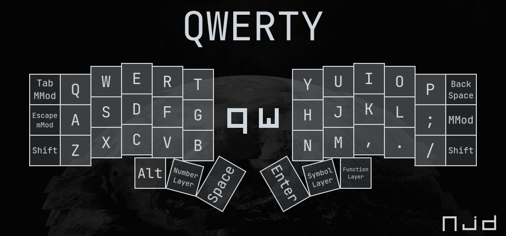

```
Tab/MMod   Q   W   E   R   T       Y   U   I   O   P   Backspace
Esc/mMod   A   S   D   F   G       H   J   K   L   ;   MMod
Shift      Z   X   C   V   B       N   M   ,   .   /   Shift
               Alt Num Space       Enter Sym Func
```

#### Dvorak

The [Dvorak][Dvorak] layout is an alpha layout, patented in 1936, to be
a more ergonomic alternative to the [QWERTY](#qwerty) layout. It is the
second most popular alpha layout for English speakers. Many Unix users
complain about the uncomfortable position of the `L` and `S` keys.

[Dvorak]: https://en.wikipedia.org/wiki/Dvorak_keyboard_layout

The `njd` Keymap version of the Dvorak layout is very slightly different
from the standard Dvorak layout. In the top-left position is the `/` key
instead of the `'` key. This is because the `'` key is located on the
Symbols layer regardless of alpha layout and the `/` key is always
located on the selected alpha layout.

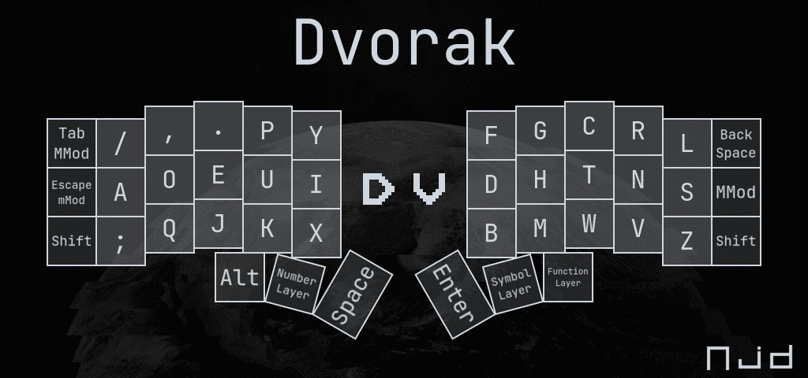

```
Tab/MMod   /   ,   .   P   Y       F   G   C   R   L   Backspace
Esc/mMod   A   O   E   U   I       D   H   T   N   S   MMod
Shift      ;   Q   J   K   X       B   M   W   V   Z   Shift
               Alt Num Space       Enter Sym Func
```

#### Workman

The [Workman][Workman] layout is designed to be an improvement over the
[Colemak](#colemak) layout with a focus on reducing lateral index finger
movement. This layout has gained popularity largely because it is used
prominently by a few popular YouTubers. While the layout does succeed at
reducing lateral index finger movement, it does this at the expense of
introducing more same finger bigrams compared to Colemak.

For those looking to learn a new alpha layout, [njdoyle][njdoyle]
recommends investigating [Colemak DH](#colemak-dh) instead of Workman.

[Workman]: https://workmanlayout.org

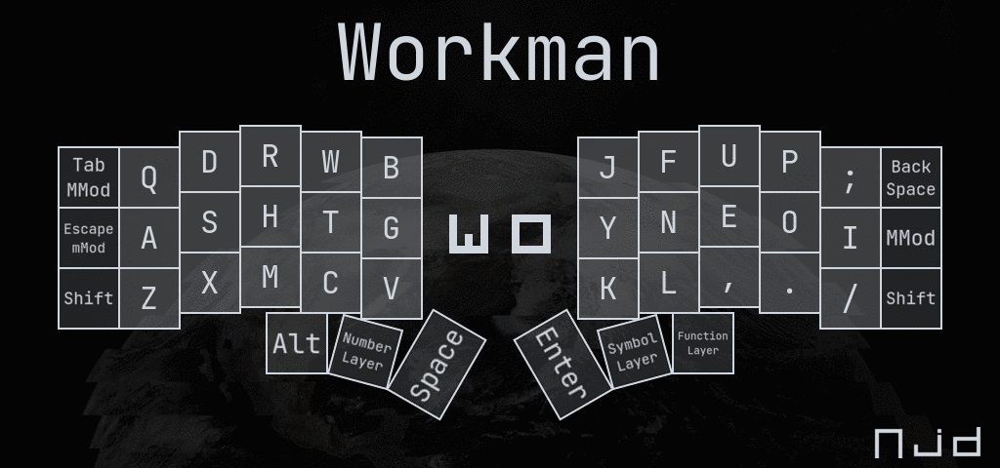

```
Tab/MMod   Q   D   R   W   B       J   F   U   P   ;   Backspace
Esc/mMod   A   S   H   T   G       Y   N   E   O   I   MMod
Shift      Z   X   M   C   V       K   L   ,   .   /   Shift
               Alt Num Space       Enter Sym Func
```

#### Colemak

The [Colemak][Colemak] layout is a more modern take on a layout design
that aims to be a more ergonomic alternative to both [QWERTY](#qwerty)
_and_ [Dvorak](#dvorak). Behind QWERTY and Dvorak, Colemak is the third
most popular alpha layout among English speakers.

Colemak focuses on keeping fingers close to the home row, reducing same
finger bigrams, and being comparatively easy to learn when migrating
from QWERTY. More details on Colemak's design can be found in it's
[design document][ColemakDesign].

[Colemak]:       https://colemak.com
[ColemakDesign]: https://colemak.com/Design

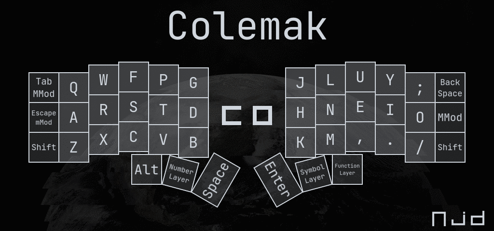

```
Tab/MMod   Q   W   F   P   G       J   L   U   Y   ;   Backspace
Esc/mMod   A   R   S   T   D       H   N   E   I   O   MMod
Shift      Z   X   C   V   B       K   M   ,   .   /   Shift
               Alt Num Space       Enter Sym Func
```

#### Colemak DH

The [Colemak DH][ColemakDH] layout is a slight modification of the
canonical [Colemak](#colemak) layout. The focus is to reduce lateral
index finger movement — like [Workman](#workman) — while also
maintaining the good low same finger bigram properties of Colemak.

This is [njdoyle][njdoyle]'s preferred and recommended alpha layout.

[ColemakDH]: https://colemakmods.github.io/mod-dh/

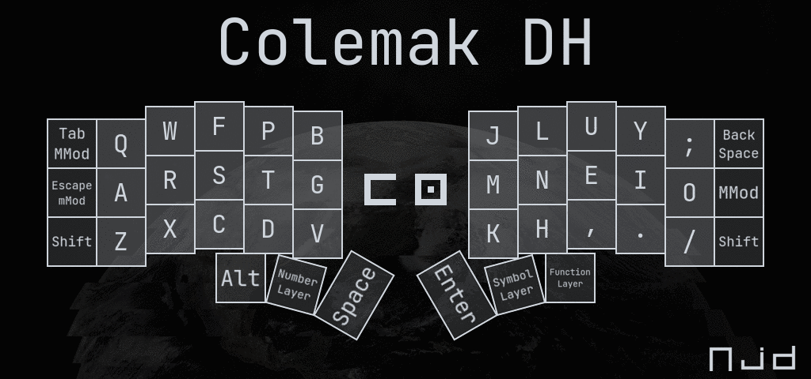

```
Tab/MMod   Q   W   F   P   B       J   L   U   Y   ;   Backspace
Esc/mMod   A   R   S   T   G       M   N   E   I   O   MMod
Shift      Z   X   C   D   V       K   H   ,   .   /   Shift
               Alt Num Space       Enter Sym Func
```

#### Colemak DHk

The [Colemak DHk][ColemakDHk] layout is a very minor variation of the
current [Colemak DH](#colemak-dh) layout. It is, in fact, the older
legacy version of Colemak DH. Colemak DHk is included in The `njd`
Keymap for those users still using this legacy layout.

[ColemakDHk]: https://colemakmods.github.io/mod-dh/keyboards.html#other-variants

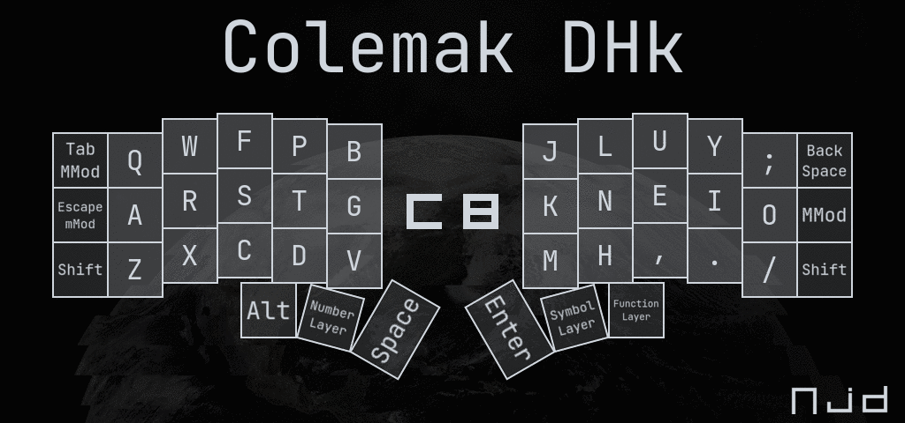

```
Tab/MMod   Q   W   F   P   B       J   L   U   Y   ;   Backspace
Esc/mMod   A   R   S   T   G       K   N   E   I   O   MMod
Shift      Z   X   C   D   V       M   H   ,   .   /   Shift
               Alt Num Space       Enter Sym Func
```

### Numbers

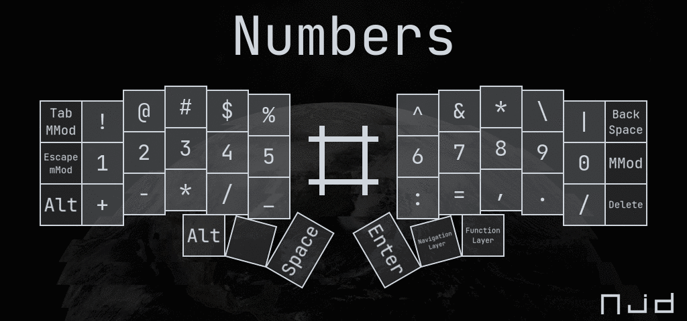

```
Tab/MMod   !   @   #   $   %       ^   &   *   \   |   Backspace
Esc/mMod   1   2   3   4   5       6   7   8   9   0   MMod
Alt        +   -   *   /   _       :   =   ,   .   /   Delete
               Alt ___ Space       Enter Nav Func
```

### Symbols

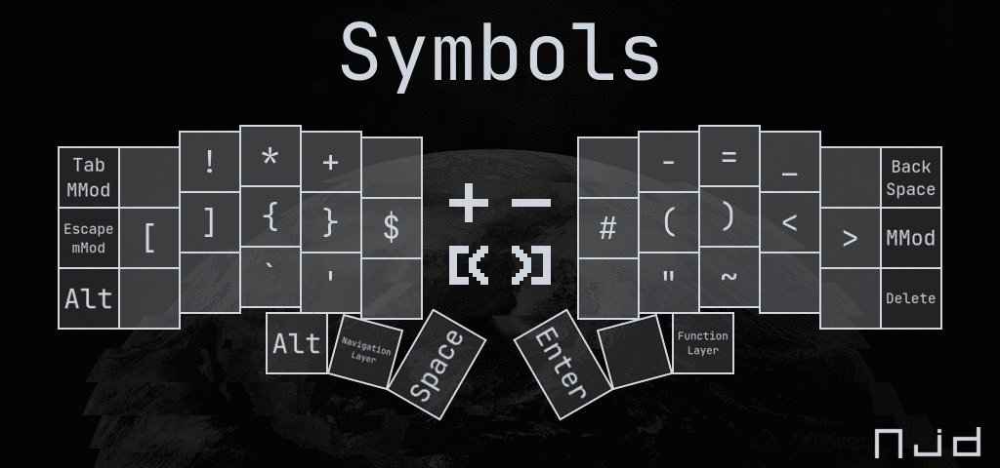

```
Tab/MMod   ___ !   *   +   ___     ___ -   =   _   ___ Backspace
Esc/mMod   [   ]   {   }   $       #   (   )   <   >   MMod
Alt        ___ ___ `   '   ___     ___ "   ~   ___ ___ Delete
                 Alt Nav Space     Enter ___ Func
```

### Navigation

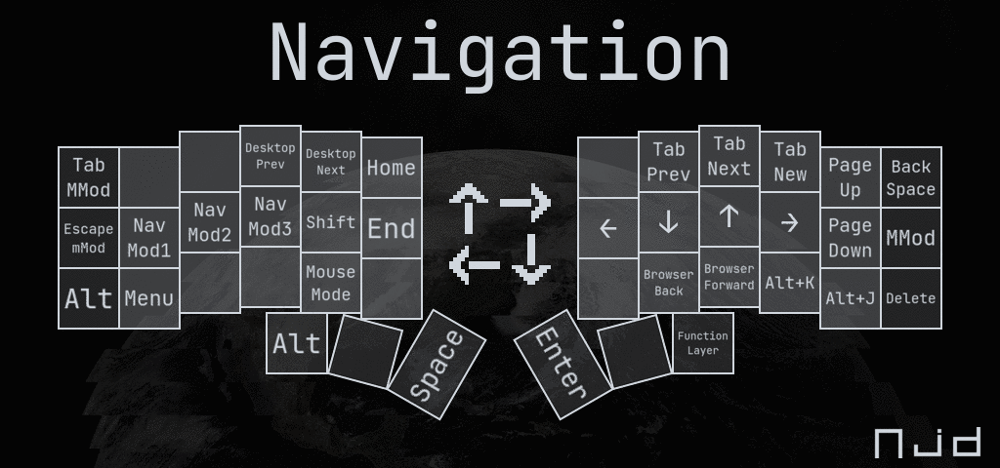

```
Tab/MMod ___  ___ DM_P DM_N  Home   ___  TB_P TB_N TB_C  PG_Up   Backspace
Esc/mMod NM1  NM2 NM3  Shift End    Left Down Up   Right PG_Down MMod
Alt      Menu ___ ___  Mouse ___    ___  BR_B BR_F Alt+K Alt+J   Delete
                    Alt ___ Space   Enter ___ Func
```

### Mouse

**This layer is modal and will remain active until it is explicitly
exited using the escape key.**

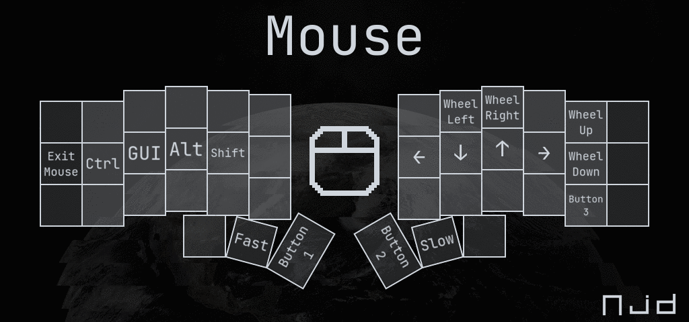

```
___  ___  ___ ___ ___   ___     ___  W_Left W_Right ___   W_Up   ___
Exit Ctrl GUI Alt Shift ___     Left Down   Up      Right W_Down ___
___  ___  ___ ___ ___   ___     ___  ___    ___     ___   Btn_3  ___
             ___ Fast Btn_1     Btn_2 Slow ___
```

### Function

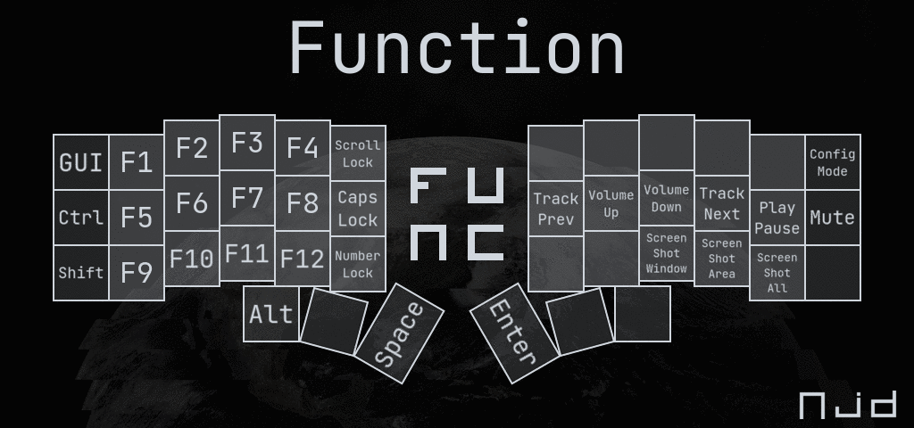

```
GUI   F1  F2  F3  F4  SLCK     ___    ___    ___      ___     ___    Conf
Ctrl  F5  F6  F7  F8  CLCK     Rewind Vol_Up Vol_Down Forward Play   Mute
Shift F9  F10 F11 F12 NLCK     ___    ___    SS_Win   SS_Area SS_All ___
             Alt ___ Space     Enter ___ ___
```

### Configuration

**This layer is modal and will remain active until it is explicitly
exited using the escape key.**

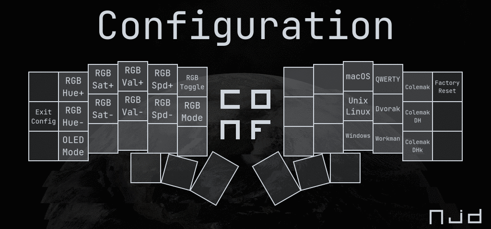

```
___  Hue+ Sat+ Val+ Spd+ RGB_T     ___ ___ Mac QWERTY  Colemak    Reset!
Exit Hue- Sat- Val- Spd- RGB_M     ___ ___ Nix Dvorak  ColemakDH  ___
___  O_M  ___  ___  ___  ___       ___ ___ Win Workman ColemakDHk ___
                   ___ ___ ___     ___ ___ ___
```


Implementation
------------------------------------------------------------------------

The `njd` Keymap is currently implemented using the [QMK Firmware][QMK]
and can be found in the [qmk_firmware](qmk_firmware/) directory. There
are future plans to port it to the [ZMK Firmware][ZMK] as well.

[QMK]: https://github.com/qmk/qmk_firmware
[ZMK]: https://github.com/zmkfirmware/zmk
